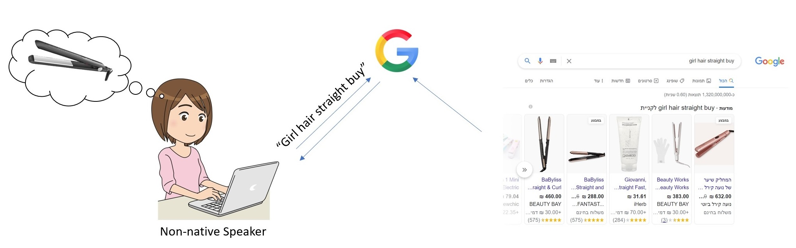

# Product-Search-Relevance-Kaggle-Competition

In this project I have built a Machine Learning system which can help Online Shopping Websites:
 * Suggest the most appropriate products, based on customer search queries.
 * Speed up getting to the product.
 * Suggests similar products.
 
This was done using 3 main NLP approaches:
  * TF*IDF.
  * Bag Of Words.
  * Word2Vec.

------

Run instructions:
  1. clone this repo.
  2. Download Dataset from: https://www.kaggle.com/c/home-depot-product-search-relevance/data
  3. Copy the downloaded data to: Repo\data
  4. Download Google GoogleNews-vectors-negative300.bin from here: https://github.com/mmihaltz/word2vec-GoogleNews-vectors
  5. Extract the gz file, navigate to the extracted dir and copy the .bin file to Repo\src
  6. Run main 
